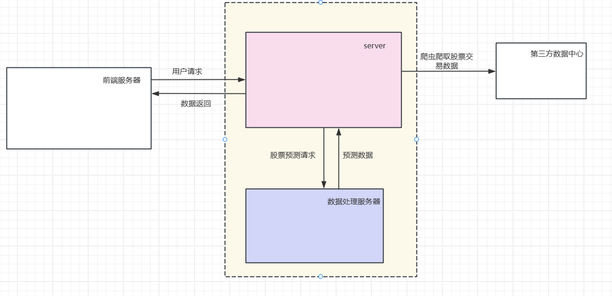

# stock-prediction
基于机器学习的股票预测系统（毕业设计），使用Java实现。

### 一、系统架构图

### 二、技术栈选型

| 主要技术栈选型 | 说明                  |
| ------- |---------------------|
| JDK     | OpenJDK17           |
| 后台      | springboot3、spring6 |
| 前台      | Vue3、Element Plus   |
| ORM     | Mybatis             |
| 缓存服务器   | redis               |
| 数据库     | MySQL8.0、influxdb   |
| 消息队列    | rabbitmq            |
| 图表工具    | Echats              |

除了上表以外，还是用到以下技术：SpringSecurity、SpringQuartz、DeepLearning4J(Java的机器学习框架)、RestTemplate、爬虫。

### 三、主要功能

- [ ] 服务器定时向第三方数据中心爬取股票每日交易信息、新增股票、交易日历、股票热门榜单
- [ ] 使用 LSTM 算法对 股票数据的 开盘价、收盘价、最高价、最低价和交易量进行预测分析
- [ ] 定时训练股票预测模型
- [ ] 定时对股票价格进行预测
- [ ] ...

### 四、说明

1. 为什么使用 DeepLearning4J?

   因为本项目主要使用 Java 进行开发，使用 Java 的机器学习框架可以快速上手开发，如果时间充裕，推荐使用基于 Python 的 TensorFlow 等深度学习框架。

2. 为什么后端服务器分为两个并独立部署？

   对股票进行模型训练的时候，如果没有 GPU，会占用大量的 CPU 资源，对其他服务会有严重的影响。分开独立部署可以减轻一定的 CPU 资源压力，服务器与数据处理服务器之间通过内部网络进行通信交换数据。

3. 数据预测的准确性如何？

   说实话，模型的预测结果不是很理想，尝试过提高 `epoch` 的次数，但结果也不理想，不但消耗的时间增加了，预测结果也没有明显的增加，应该说，使用 5 个数据推测 5 个数据是十分困难的。但是，除了`交易量`，其余数据的趋势与实际数据的是相似的。

4. 训练集有多大？

   训练数据从 “**2010-01-01**” 开始一直到当前时间的所有股票交易数据，训练集与测试集的比例为: **9 : 1**。一般来说至少有500条以上的数据，当数据集为 **2000 多条**时，使用 `GTX1060`训练一次需要 **7 分钟**。如果数据集在 800 条以内，使用 CPU `AMD Ryzen 5 4500U` 训练一次需要**30分钟**。

5. 为什么使用 Influxdb？

   InfluxDB 是一个专门用来处理时序数据的数据库。对于股票而言，其交易信息正好是以时间来排列的，使用InfluxDB处理的话可以起到事半功倍的效果，比如可以快速的获取到某个时刻到另一个时刻间的所有数据。

   ### 五、预测图/运行图

   #### 5.1 epoch200

   #### 5.2 epoch110

   #### 5.3 epoch100

